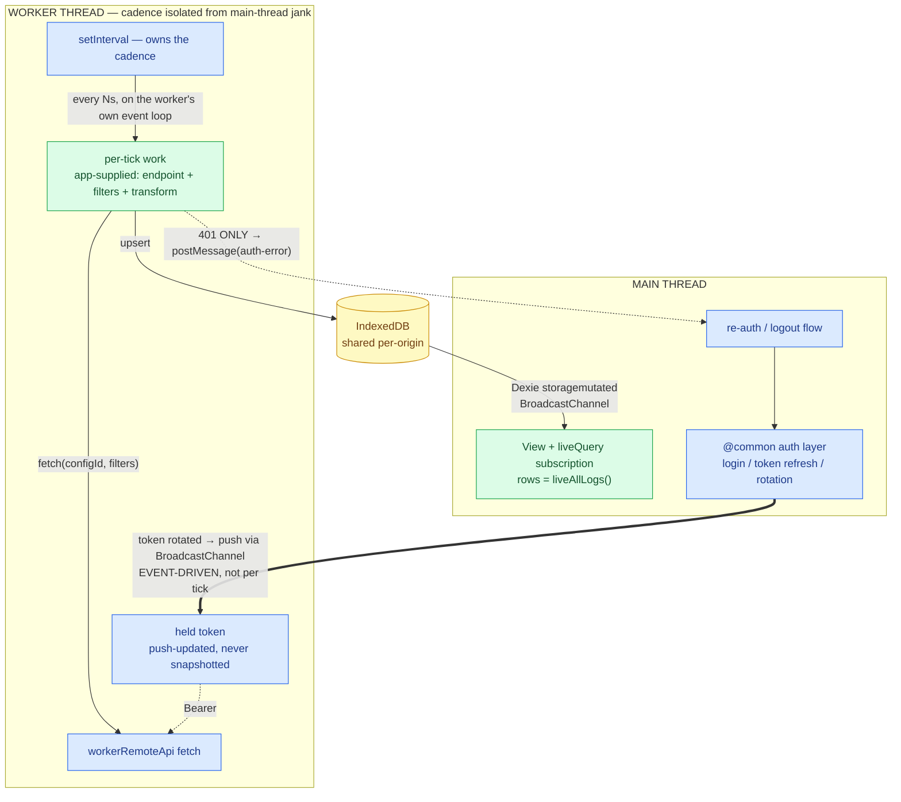

# Worker Polling Service — design proposal

**Status:** Draft / proposal (nothing implemented in `@common` yet)
**Drafted:** 2026-07-26
**First consumer:** the DataManagerLog log-cache poll in the `company` app
**Where it would live:** `@common` (shared lib — cross-app change, see [Blast radius](#blast-radius))

---

## 1. Problem

We want background polling (fetch on a cadence → cache locally → drive a live UI) to be a
**framework capability of accxui**, not something each app re-implements. Today accxui ships
worker *plumbing* but no worker *policy*:

- `@common/core/workerFactory.ts` — spawns a Comlink-wrapped worker. **(exists)**
- `@common/core/workerRemoteApi.ts` — a bare-`fetch` API client for workers. **(exists)**

Every consumer (cycle count today; the DataManagerLog poll now) hand-rolls the *policy* on top
of that plumbing — the interval, the teardown, and the auth handoff. That leaves three things
to each app developer to get right or wrong:

1. **Cadence isolation.** If the poll timer runs on the main thread, an app dev's inefficient
   main-thread code (a heavy render, a long synchronous loop) can delay or skip the sync. The
   framework's own cadence becomes breakable by application code.
2. **Token freshness.** A worker is a separate JS realm; it cannot read the in-memory bearer
   token (`commonUtil.getToken()` resolves on the main thread only — `getEmbeddedAppStoreSafe()`
   / cookie, neither reachable from a worker). So the token has to be *handed in*. If it is
   snapshotted once at start and reused in a loop, it goes stale on rotation and requests
   silently 401 (bare `workerRemoteApi` has no 401→logout interceptor).
3. **Lost cross-cutting behavior.** `api()`'s interceptors (auth attach, 401→logout, error
   normalization) don't exist in the worker's bare fetch.

**Cycle count demonstrates the risk rather than solving it.** Its recurring sync snapshots the
token once and reuses it in a `setInterval` closure forever:

- `apps/inventory-count/src/workers/backgroundAggregation.ts:752-762` — `type: 'schedule'`
  captures `context` (incl. token) once; the interval reuses it every tick.
- `apps/inventory-count/src/workers/lockHeartbeatWorker.ts:34-50` — clones the payload once
  into `currentState`, reuses `currentState.token` in its interval.

It gets away with it only because the worker is spawned/torn down per session view (so a fresh
token is captured each mount) and Maarg JWTs (~2h) usually outlive a session. A long-running
loop across a token rotation would fail silently. That is exactly the footgun this proposal
removes.

## 2. Goals / non-goals

**Goals**
- Polling cadence and persistence are **isolated from main-thread jank** (run in the worker).
- The bearer token is **always current**, with **zero per-tick main-thread coupling**.
- Auth, cadence, transport, teardown, and 401 handling are **framework-owned** — an app dev
  cannot break them.
- App devs supply only domain logic: endpoint, filters, per-tick transform.
- Data reaches the UI reactively without postMessaging payloads around.

**Non-goals**
- Offline write queue / conflict resolution (that is cycle count's sync concern, separate).
- Background execution while the tab is closed (a dedicated Worker dies with the page; that is
  a Service Worker + Periodic Background Sync concern, out of scope — see the earlier finding
  that SW lifecycle makes 10s cadence infeasible).

## 3. Flow



Blue = framework-owned (`@common`); green = app-supplied.

**Three load-bearing claims to read from the diagram:**

1. **The whole hot loop is inside the worker box** (`LOOP → WORK → HTTP → IDB`). Nothing crosses
   the thread boundary per tick, so inefficient main-thread app code cannot delay or skip a sync.
2. **Only two arrows cross the boundary, and neither is per-tick:** the token push (fires only on
   rotation) and the 401 report (fires only on auth failure). The token is never snapshotted and
   never pulled synchronously mid-loop — freshness without re-coupling to the main thread.
3. **Data returns to the UI without a data postMessage** — the worker writes IndexedDB, Dexie's
   `storagemutated` broadcast wakes the main-thread `liveQuery`, the UI repaints. Under
   main-thread jank only the *repaint* waits; the data is already durably persisted.

## 4. Ownership split

| Framework-owned (`@common`) — app dev cannot touch | App-supplied |
| --- | --- |
| the interval + teardown | the per-tick work (one fetch + upsert) |
| **fresh token every tick** (push-updated) | endpoint / configId / filters |
| `workerRemoteApi` transport + `Bearer` header | the result transform / cache shape |
| 401 → app's re-auth flow | — |
| worker spawn via `workerFactory` | — |

## 5. Key mechanisms

### 5.1 Cadence isolation
The `setInterval` runs on the worker's event loop. Fetch, parse, and the Dexie write all execute
on the worker thread. Main-thread load cannot stall them. **Protected:** the fetch→persist
pipeline. **Best-effort:** the UI repaint (main-thread `liveQuery` emit), which waits under jank
but never loses data.

### 5.2 Token freshness (event-driven, not pull-per-tick)
The naive "worker calls a Comlink-proxied `getToken()` each tick" is **rejected** — it puts a
main-thread call back into the hot loop, re-coupling cadence to main-thread jank (defeats §5.1).

Instead, `@common`'s auth layer **publishes** the token whenever it changes (login, refresh,
rotation), and the worker holds the latest:

- **Primary: BroadcastChannel push.** On rotation the auth layer broadcasts the new token; the
  worker listens and updates its held value. Event-driven, no per-tick work.
- **Optional: IndexedDB mirror.** The token is also written to a small IDB record so a
  freshly-spawned worker can read a current token before the first push arrives (bootstrap).

Cookies / `localStorage` are **not** options — neither is reachable from a worker realm.

### 5.3 401 error path
Even with freshness plumbing, a server-side revocation can still 401. On a 401 the worker
`postMessage`s an `auth-error`; the service routes it to the app's re-auth/logout flow — the
behavior `api()`'s response interceptor gives on the main thread, restored for the worker.
This is the error path, not the hot path.

### 5.4 Data return
The worker writes results to a Dexie store. Dexie ≥3.2 (this repo runs 4.4.3) broadcasts every
commit over a BroadcastChannel; the main thread's `liveQuery` receives it and re-emits
(`dexie.js` — `bc = new BroadcastChannel(...)` → `propagateLocally` → `storagemutated`). No
payload is postMessaged; IndexedDB is the shared medium.

## 6. Proposed `@common` API — PROPOSED, does not exist yet

```ts
// @common/core/createPollingService.ts  (PROPOSED)
interface PollingServiceOptions {
  workerUrl: URL;                 // new URL('../workers/x.worker.ts', import.meta.url)
  intervalMs?: number;            // default 10_000
  args?: unknown;                 // app config passed to the worker (filters, configId, …)
  onAuthError?: () => void;       // wired to the app's re-auth/logout
}
interface PollingService {
  start(): Promise<void>;
  pollNow(): Promise<void>;
  stop(): void;                   // terminates worker + interval + unsubscribes token push
}
export function createPollingService(opts: PollingServiceOptions): PollingService;
```

```ts
// @common auth layer addition (PROPOSED): publish token on change
//   - broadcast over a well-known BroadcastChannel on login/refresh/rotation
//   - (optional) mirror into an IDB record for worker bootstrap
// Worker side receives it via a shared @common helper, e.g. subscribeToken(cb).
```

The **app dev writes only** a worker whose per-tick function does `fetch(args) → transform →
Dexie upsert`, using the token the framework keeps fresh — and a one-line `createPollingService`
call. They never write the interval, the token handoff, or the teardown.

## 7. Existing building blocks — EXISTING (evidence)

| Piece | File | Note |
| --- | --- | --- |
| Comlink worker spawner | `common/core/workerFactory.ts:8` | returns `{ api, terminate, worker }` |
| Worker fetch client | `common/core/workerRemoteApi.ts` | takes explicit `baseURL` + `headers` |
| Token / base URL accessors | `common/utils/commonUtil.ts:405` (`getToken`), `:368` (`getMaargURL`) | main-thread only |
| Main-thread interceptors | `common/core/remoteApi.ts:8-51` | auth attach + 401→logout (the behavior §5.3 restores) |
| Cross-context liveQuery | `dexie@4.4.3/dist/dexie.js` (`BroadcastChannel` + `storagemutated`) | the §5.4 mechanism |
| Reference (snapshot-token anti-pattern) | `apps/inventory-count/.../backgroundAggregation.ts:752` | what this replaces |

## 8. Blast radius

The token-publish hook lands in `@common`'s auth layer and the primitive in `@common/core` —
**every accxui app depends on this** (`company`, `inventory-count`, `order-routing`, …).

- **Upside:** cycle count can adopt `createPollingService` and shed its snapshot-token bug for
  free; all future polling is correct by construction.
- **Cost:** wider review surface; changing the auth layer needs care and buy-in beyond this one
  page. Token-publish must not log/persist the token anywhere durable in plaintext (IDB mirror,
  if used, holds the same value the app already holds in memory — no new exposure, but call it
  out in review).

## 9. Alternatives considered

| Option | Verdict |
| --- | --- |
| **Main-thread interval calling `worker.pollOnce(freshToken)`** | Rejected — couples cadence to main-thread jank (an inefficient app view can starve the sync). |
| **Worker loop + per-tick Comlink `getToken()` callback** | Rejected — reintroduces a main-thread call into the hot loop; same coupling. |
| **Snapshot token once at `start()` (today's worker + cycle count)** | Rejected — stale token on rotation → silent 401s. |
| **Worker loop + event-driven token push (this proposal)** | Chosen — isolated cadence AND fresh token, both framework-owned. |

## 10. Open decisions

1. **Token transport:** BroadcastChannel push only, or push + IDB bootstrap mirror? (Bootstrap
   matters if a worker can start before the first push.)
2. **Interval residence when there is no heavy per-tick work:** for a light poll (small JSON),
   is the worker even warranted, or should `createPollingService` support a main-thread mode
   too and let the caller choose? (Keeps one API; picks the thread per workload.)
3. **Where the shared Dexie DB definition lives** when multiple apps cache different entities —
   per-app DB vs a `@common` base.
4. **Adoption order:** land primitive → migrate the company DataManagerLog poll → then cycle
   count, or prove it fully in `company` first behind an app-local copy before touching `@common`.
```
