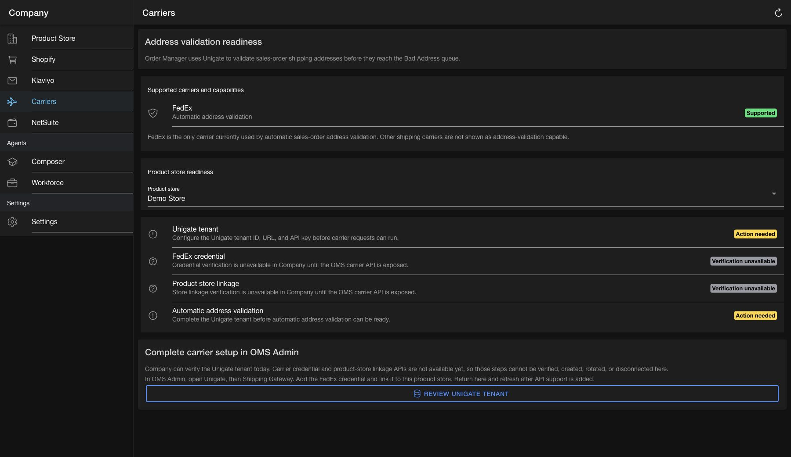

# Carrier credential readiness and API gap

Company's `/carriers` page is designed around the carrier path used by automatic sales-order address validation.

## Current address-validation contract

`validate#SalesOrderAddress` in `hotwax-poorti` calls `validate#Address` with `carrierPartyId: FEDEX`. The request sent to Unigate contains:

- the `ShippingCarrierConfig.gatewayAuthId` as `shippingGatewayAuthId`
- `FEDEX` as `carrierPartyId`
- the order shipping addresses

This makes FedEx the only carrier Company can claim as address-validation capable today. Demo carrier configurations for Purolator, Canada Post, Shiphawk, C807, and DrivIn support other shipping concerns but are not selected by automatic sales-order address validation.

Address validation is ready only when all of these prerequisites exist:

1. `UNIGATE_CONFIG` has a tenant ID, base URL, and API key.
2. Unigate has a FedEx `ShippingGatewayAuth` credential.
3. The product store has a `ShippingCarrierConfig` linked to that credential through `gatewayAuthId`.

## Current frontend behavior

Company can currently read `UNIGATE_CONFIG` and product stores. The page reports those values from the authenticated backend and treats every unobservable prerequisite as `Verification unavailable`. It never interprets unavailable data as disconnected or ready.

Tenant details and API-key rotation reuse the existing Unigate tenant modal. Carrier credential creation, masking, rotation, disconnect confirmation, and product-store linking remain in OMS Admin until the missing APIs are available.

## Missing OMS REST resources

OMS defines the following services in `UnigateServices.xml`:

- get, create, update, and delete `ShippingGatewayAuth`
- `get ShippingGatewayConfigs`

The OMS Shipping Gateway screen also reads and writes `ShippingCarrierConfig` directly. These services and entities are not exposed as Company-consumable REST resources. Authenticated validation against `test-maarg` on July 13, 2026 returned:

| Resource | Status |
| --- | --- |
| `admin/productStores` | 200 |
| `oms/systemMessageRemotes` | 200 |
| `oms/shippingGatewayAuths` | 404 |
| `oms/shippingGatewayConfigs` | 404 |
| `oms/shippingCarrierConfigs` | 404 |

The recommended backend follow-up is to expose list/create/update/delete resources for shipping gateway auths, a list resource for supported shipping gateway configs, and scoped list/store/delete resources for `ShippingCarrierConfig`. Responses should preserve write-only secrets so Company can show masked values without receiving full credentials.

## Authenticated UI evidence

The screenshot below shows the stable route using the real `test-maarg` product-store and Unigate responses. No mocked API data is used.

