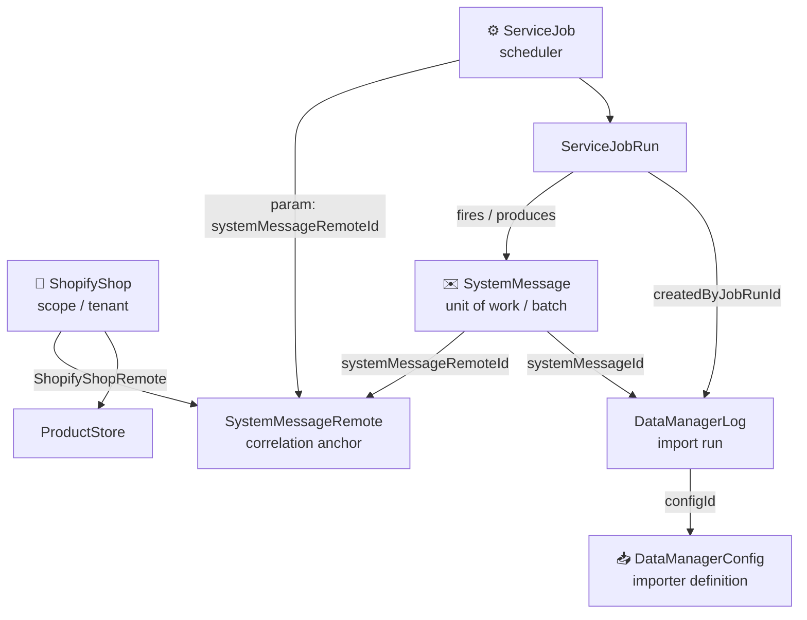

# Integration Domain Model & Test Plan — Order Sync (and beyond)

> **Status:** architecture + test-driven rebuild plan. Branch
> `codex/company-shopify-batch-order-sync`. Last updated 2026-07-25.
>
> This replaces the earlier feature-pipeline plan. The insight: Order Sync is not
> a bespoke feature — it is one **composition of four Moqui entities**. Model those
> entities once as reusable domain objects (model + behaviors + Pinia store), and
> Order Sync, Product Sync, and any future integration screen become thin
> compositions over them. Requirements come from `shopify-batch-order-sync-scope.md`,
> `-delivery-ledger.md`, `-api-reuse.md` (acceptance rows `C* M* K* X*`).

---

## 1. The strategic shift: feature silos → domain entities

**Today:** the four entities are already modeled in the frontend, but under
feature-coupled names and **duplicated per feature** — two stores (1,959 lines
order sync + 1,542 product sync) re-model the same entities independently:

| Moqui entity | Order Sync names it | Product Sync names it |
|---|---|---|
| `ServiceJob` | `SafeShopifyOrderSyncJob` | `ShopifyProductSyncRun` (partial) |
| `SystemMessage` | `ShopifyOrderSyncBatch` | `ShopifyProductSyncHistoryRun` |
| `DataManagerLog` | `ShopifyOrderSyncImport` | (its own) |
| `ShopifyShop` + remote | `SafeShopifyOrderSyncShop/Remote` | (its own) |

Nothing composes because there is no shared domain layer. Worse, the two most
important behaviors — `SystemMessage` status → state, and `DataManagerLog` status
→ outcome — exist today only as **private helpers** (`systemMessageProgressState`,
`normalizeLogOutcome`) buried inside one feature function, so they can't be tested
or reused directly. That is the root of "these functions don't build on each other."

**Target:** four domain modules, each `Model + Behaviors (pure) + Store (Pinia)`,
feature-agnostic. Features pass *parameters* (message type, config IDs, permission)
and compose the stores into a view-model.

---

## 2. The domain model

Verified backend FKs (maarg-oms). Three correlation keys thread all four entities:



| Correlation key | Joins | Meaning |
|---|---|---|
| `systemMessageRemoteId` | ShopifyShop ↔ ServiceJob ↔ SystemMessage | shop scope (the tenant guard) |
| `systemMessageId` | SystemMessage ↔ DataManagerLog | batch correlation (the two-row join) |
| `createdByJobRunId` | ServiceJobRun ↔ DataManagerLog | run correlation |

**Verified status vocabularies** (authoritative `StatusItem` seed) — these are the
ground truth for the two headline entity behaviors:

- **SystemMessage (11):** `SmsgTriggered SmsgProduced SmsgSending SmsgSent
  SmsgReceived SmsgConsuming SmsgConsumed SmsgConfirmed SmsgRejected SmsgCancelled
  SmsgError`
- **DataManagerLog (7):** `DmlsPending DmlsQueued DmlsRunning DmlsFinished
  DmlsFailed DmlsCrashed DmlsCancelled` — note: **no `DmlsError`** exists in the
  seed; the current code matches an `"error"` token that never appears. Terminal
  failure is `DmlsFailed`/`DmlsCrashed`/`DmlsCancelled` (see §8).

---

## 3. The four domain modules

Each = **Model** (typed shape) · **Behaviors** (pure fns = the questions you ask of
one entity) · **Store** (Pinia, load/cache/mutate) · **Relationships**. All are
feature-agnostic.

### 🏪 ShopifyShop — the tenant context
- **Model:** `{ shopId, myshopifyDomain, name, productStoreId, remote: SystemMessageRemote, accessScope }`
- **Behaviors:** `resolveRemoteId(shop)` (canonical `ShopifyShopRemote` link → legacy fallback → reject ambiguous/no-access) · `isRecordInShop(record, shop)` (scope guard)
- **Store `useShopifyShopStore`:** `selectedShop`, `remoteForShop`, `loadShop(shopId)`, `loadRemote(shopId)`. Every other store reads the selected shop/remote from here.
- **Relationships:** owns `SystemMessageRemote`; links `ProductStore`.

### ⚙️ ServiceJob — scheduling, generic over any job type
- **Model:** `{ jobName, parentJobName, serviceName, cronExpression, paused, parameters[], latestRun }`
- **Behaviors:** `parameterMap(job)` · `isPaused(job)` · `isSuitable(job, {remoteId, messageType})` · `findSuitable(jobs, …)` · `lifecycleState(job) → missing|configured|paused|active` · schedule: `validateCron` / `nextRun` / `isDirty` / `inheritFromTemplate` / `describe`
- **Store `useServiceJobStore`:** `loadJobsForScope(template, remoteId)`, `clone(template, scope)`, `updateSchedule`, `setPaused`, `runNow`, `loadRuns(jobName)`.
- **Relationships:** `ServiceJobParameter.systemMessageRemoteId` → shop; `ServiceJobRun` produces `SystemMessage`; `DataManagerLog.createdByJobRunId` → run.

### ✉️ SystemMessage — the batch, generic over any message type
- **Model:** `{ systemMessageId, systemMessageTypeId, systemMessageRemoteId, statusId, initDate, processedDate }`
- **Behaviors:** `messageState(statusId) → pending|active|completed|failed` *(tested & fixed — see §8)* · `isTerminal(msg)` · `isSuccess/isFailure(msg)` · `belongsToRemote(msg, remoteId)`
- **Store `useSystemMessageStore`:** `loadMessages({remoteId, typeId, limit})`, `loadMessage(id)`, `loadMessageErrors(id)`. Owns the `Smsg*` vocabulary once, for all features.
- **Relationships:** belongs to remote → shop; produced by job run; correlated to `DataManagerLog` via `systemMessageId`.

### 📥 DataManagerConfig / DataManagerLog — the importer, generic over any config
- **Model (Log):** `{ logId, parentLogId, configId, statusId, systemMessageId, createdByJobRunId, totalRecordCount, failedRecordCount, startDateTime, finishDateTime, errorRecordContentId, productStoreId }`
- **Behaviors:** `logOutcome(log) → {state, total, success, failed}` (owns `Dmls*` vocabulary; success = explicit or `total − failed`) · `correlateByMessage(logs, systemMessageId)` · `aggregateCounts(logs)` · `isTerminal(log)`
- **Store `useDataManagerStore`:** `loadLogs({configIds, systemMessageId, productStoreId})`, `loadLogDetail(logId)`, `fetchErrorFile(log)`.
- **Relationships:** log → config (`configId`); log → message (`systemMessageId`); log → run (`createdByJobRunId`).

---

## 4. The feature layer = thin composition

`useShopifyOrderSyncStore` stops re-modeling entities and becomes a **view-model**
that joins the four domain stores with Order-Sync parameters:

```
orderSync = {
  shop:    shopStore.selectedShop,
  job:     serviceJobStore.suitable("queue_ShopifyOrderSync", remote),
  batches: systemMessageStore.messages({ typeId: "ShopifyOrderSync", remote }),
  imports: dataManagerStore.byMessage(batch.systemMessageId,
             { configIds: ["SYNC_SHOPIFY_ORDER", "UPDATE_SHOPIFY_ORDER"] }),
}
progress = composeProgress(messageState(batch), aggregate(imports.map(logOutcome)))
```

**Product Sync** composes the *same four stores* with its own message type + bulk-op
configs. The "no Shopify bulk-operation row" rule is simply that Order Sync's
composition omits a bulk-op node while Product Sync's includes one — same entities,
different assembly. The next integration screen (Klaviyo, NetSuite) composes the
same substrate.

---

## 5. Test strategy, reorganized by domain

The layers are unchanged; what changes is the *unit of test* — it's the **entity
behavior**, tested once and reused by every feature.

- **L1a — entity behaviors** (pure, per entity, exhaustive vs real status vocab). Reusable across features. *This is the bulk of "bulletproof," and the cheapest.*
- **L1b — composition functions** (join two+ entities: progress, overall state, processed/error lists, capabilities, polling delay). Small, deterministic.
- **L2a — entity stores** (load/cache/scope/guard per store; mock only the HTTP boundary + permission store).
- **L2b — feature view-model store** (Order Sync orchestration: correlation, run-now guard, retry, stale-response guards).
- **L3 — components/views** (real `mount`, stub only Ionic; assert visible facts / `aria-*` / emitted intents — **never** source text or CSS).
- **L4 — live reconciliation** (Playwright + seeded OMS; parity, a11y, real-number reconciliation). "Proven" is earned only here.

Status legend: ⬜ Planned · 🟡 Implemented (focused test green) · ✅ Proven (live-reconciled).

---

## 6. Behavior & composition catalog

### 6a. Entity behaviors — L1a

| Behavior | Entity | Invariants to test | Rows | Exists today | Status |
|---|---|---|---|---|---|
| `messageState(statusId)` | SystemMessage | all 11 real `Smsg*` → correct enum; only in-progress verbs (`Sending`/`Consuming`) are active; staged (`Triggered`/`Produced`/`Received`) pending; `Sent`/`Consumed`/`Confirmed` completed; `Rejected`/`Cancelled`/`Error` failed | M2, M5 | ✅ `utils/systemMessage.ts` (explicit map) | 🟡 |
| `isTerminal` / `isSuccess` / `isFailure` | SystemMessage | terminal set = completed+failed; success ≠ failure | M18, M19 | ⬜ new | ⬜ |
| `belongsToRemote(msg, remoteId)` | SystemMessage | rejects cross-remote messages | X1, M1 | ⬜ new | ⬜ |
| `logOutcome(log)` | DataManagerLog | all 7 real `Dmls*` → correct `{state,total,success,failed}`; `DmlsFinished`→completed; `DmlsFailed`/`Crashed`/`Cancelled`→failed; partial when success>0 & failed>0; success derives from counts | M3, M6 | **private** `normalizeLogOutcome` → **hoist + export** | ⬜ |
| `aggregateCounts(logs)` | DataManagerLog | sums across 0/1/2 logs; dedupes repeated log rows | M6, M8 | inside `deriveProgress` | ⬜ |
| `correlateByMessage(logs, id)` | DataManagerLog | returns only logs for that `systemMessageId` | M18 | store-side | ⬜ |
| `parameterMap` / `isPaused` / `isSuitable` / `findSuitable` | ServiceJob | provenance + scope; legacy-clone match; paused variants | C2, C3, C5, C7 | ✅ util (feature-named) | ⬜ |
| `lifecycleState(job)` | ServiceJob | `missing/configured/paused/error` distinct; error ≠ missing | C5 | `deriveOrderSyncConfigurationState` | ⬜ |
| schedule `validateCron`/`nextRun`/`isDirty`/`inherit` | ServiceJob | validation codes; tz next-run; dirty on toggle; inherit exact | C8, C10 | ✅ schedule util | ⬜ |
| `resolveRemoteId(shop)` | ShopifyShop | canonical link authoritative; legacy fallback; reject ambiguous | C3, X1 | partial `getSystemMessageRemoteId` | ⬜ |

### 6b. Composition functions — L1b

| Function | Joins | Invariants | Rows | Exists | Status |
|---|---|---|---|---|---|
| `composeProgress(message, logs)` | Msg + Log | two rows; **never bulk-op row**; 0/1/2 imports (accumulate, not pair-per-page); detail keeps separate counts | M2, M3, M5 | `deriveShopifyOrderSyncProgress` (monolithic) | 🟡 (batch row) |
| `overallState(batchRow, importRow)` | rows | mixed→partial; completed mirrors import; failed+records→partial; non-terminal wins | M4, M5 | ✅ | 🟡 |
| `recentProcessed(audits, logs)` | Audit + Log | count from **DataManager logs, not query**; `processedDate` never proof; cap 100, newest-first, Created/Updated | M6, M8 | `normalizeRecentProcessedOrders` | ⬜ |
| `recentErrors(logs)` | Log | cap 100 across **both** config IDs; safe fields; retry-target resolvable only w/ real Shopify provenance | M7, M9, M17 | `normalizeRecentOrderErrors` | ⬜ |
| `mappingReadiness(families)` | (config-side) | 3 families; missing→warning; **error ≠ missing** | C4, C6 | ✅ | ⬜ |
| `capabilities(permissions)` | (auth) | monitor broad; mutations require `COMMON_ADMIN`; no near-match grant | X9 | ✅ | ⬜ |
| `pollingDelay({batchActive})` | — | 10s active / 60s idle | M12 | ✅ | ⬜ |
| `searchLoaded*(rows, q)` | — | filter loaded rows only, **zero transport**, newest-first | M14 | ✅ | ⬜ |

### 6c. Entity + feature stores — L2

| Store surface | Layer | Invariants | Rows | Status |
|---|---|---|---|---|
| `useSystemMessageStore.loadMessages` | L2a | scope by remote+type; reject cross-shop/stale | M1, X1 | ⬜ |
| `useDataManagerStore.loadLogs` | L2a | scope by product store; correlate by message | M6, M18 | ⬜ |
| `useServiceJobStore.clone/updateSchedule/setPaused/runNow` | L2a | allowlisted payloads; clone starts Paused + inherits cron; older read never overwrites mutation; run-now overlap guard | C2, C7, C8, C10, M13, M15 | ⬜ |
| `orderSync.loadMonitoring` | L2b | batch grouping by `systemMessageId`; last-completed metrics; keep last-good on refresh fail | M1, M10 | ⬜ |
| `orderSync.retryIndividualOrder` | L2b | 1–30 digit target; new standalone message no parent; original error immutable; UUID reuse→rotate; available during active batch; reject cross-shop | M17, M19–M22 | ⬜ |
| `orderSync.requireAdmin` / `invalidateRequests` | L2b | every mutation gated on current caller; route change invalidates in-flight; no commit after shop change | X9, X1 | ⬜ |

### 6d. Components & live — L3 / L4

| Target | Invariants | Rows | Status |
|---|---|---|---|
| `ShopifyOrderSyncCard` (L3) | two rows, never bulk-op; emits `open` only when actionable; `aria-disabled/busy` | K1, K2, M2 | ⬜ |
| Configure view (L3) | 3 families; activation-with-warnings acknowledged; read-only w/o admin | C4, C6, C9, X9 | ⬜ |
| Monitor view (L3) | partial outcome; 4 empty states; run-now disabled during active; retry hidden for monitor-only; verified Shopify link only w/ provenance | M4, M5, M13, M15, M17 | ⬜ |
| History view + modals (L3) | one run per batch newest-first; filters; safe projected facts, no raw payload | M1, M11 | ⬜ |
| Live reconciliation (L4) | summary/card numbers reconcile; parity @375px; a11y; synthetic import `fetchVerified=N`; real Shopify no write-back | M1, K4, X7, X8, X13, X14, X18 | ⬜ |

---

## 7. Traceability (rows → owning domain node → status)

| Row | Owns it | Layer | Status |
|---|---|---|---|
| C1 | ShopifyShop store + Configure view | L2/L3 | ⬜ |
| C2, C3 | ServiceJob `isSuitable`/`findSuitable`/`resolveRemoteId` + `clone` | L1a/L2a | ⬜ |
| C4, C6 | `mappingReadiness` | L1b | ⬜ |
| C5 | ServiceJob `lifecycleState` | L1a | ⬜ |
| C7, C10 | ServiceJob `inherit`/`isPaused` + `clone` | L1a/L2a | ⬜ |
| C8 | ServiceJob schedule behaviors + `updateSchedule` | L1a/L2a | ⬜ |
| C9 | Configure view + `setPaused` | L2/L3 | ⬜ |
| M2, M3 | `composeProgress` (Msg `messageState` + Log `aggregate`) | L1a/L1b | 🟡 |
| M4 | `overallState` | L1b | 🟡 |
| M5 | `composeProgress` + `overallState` | L1b | 🟡 |
| M6, M8 | Log `logOutcome`/`aggregate` + `recentProcessed` | L1a/L1b | ⬜ |
| M7, M9 | `recentErrors` | L1b | ⬜ |
| M10 | `orderSync.refresh` + `useShopifyOrderSyncPolling` (was `useLiveDashboard`, deleted 2026-07-28) | L2b | ⬜ |
| M11 | store projections + modals | L1/L2/L3 | ⬜ |
| M12 | `pollingDelay` + `useShopifyOrderSyncPolling` | L1b/L2 | ⬜ |
| M13, M15 | `useServiceJobStore.runNow` + guards | L2a | ⬜ |
| M14 | `searchLoaded*` | L1b | ⬜ |
| M17, M19–M22 | `recentErrors` + `retryIndividualOrder` | L1b/L2b | ⬜ |
| M18 | `correlateByMessage` + `loadMonitoring` | L1a/L2b + L4 | ⬜ |
| M1, K1–K4 | feature stores + Card + live | L2/L3 + L4 | ⬜ |
| X9 | `capabilities` + `requireAdmin` | L1b/L2b | ⬜ |
| X1 | `belongsToRemote`/`isRecordInShop` + store guards | L1a/L2 | ⬜ |
| X7/X8/X13/X14/X18 | live reconciliation | L4 | ⬜ |

---

## 8. Reconciliation findings (map vs current code)

- **Two behaviors must be hoisted first.** `messageState` and `logOutcome` are
  currently **private** (`systemMessageProgressState`, `normalizeLogOutcome`) inside
  `deriveShopifyOrderSyncProgress`. Extracting and exporting them (into the
  SystemMessage / DataManagerLog modules) is the single change that makes the domain
  testable and reusable. Do this before the big refactor.
- **Bug found & fixed:** `messageState` mapped `SmsgConsuming`→`pending` (active-token
  list omitted `consuming`). Corrected to treat only in-progress verbs as active;
  guarded by `deriveShopifyOrderSyncProgress.batchRequest.spec.ts`.
- **`DmlsError` does not exist.** The seed has no `DmlsError`; `logOutcome`'s
  `"error"` token never fires. Real terminal failure = `DmlsFailed`/`DmlsCrashed`/
  `DmlsCancelled`. The `logOutcome` test must use the real 7 statuses and confirm
  the phantom token is harmless (or removed).
- **Duplication is the cost signal:** ServiceJob/SystemMessage/DataManagerLog are
  modeled twice (order sync + product sync). Each domain module deleted from a
  feature silo is net line reduction plus a single place to test.

---

## 9. Conventions

1. One invariant per test; name it after the behavior, not the method.
2. Test at the lowest layer; never re-assert an entity behavior at a higher layer.
3. Mock only at boundaries (HTTP `api`, permission store, Ionic lifecycle). Never mock the unit under test.
4. Banned: asserting on source text, template markup, CSS strings, or imports. If it can't be proven by running the code, it's L4, not a fake unit test.
5. Red-first from the acceptance row / Invariants column.
6. Ground fixtures in reality — the verified `Smsg*` (11) and `Dmls*` (7) vocabularies, real REST envelopes.

---

## 10. Progress & build order

**Layer homes** (decided): pure behaviors → `utils/` (Vue-free); reactive logic →
`composables/use*` (import the behaviors); shared app state → `store/`; UI → `views/`.
No `domain/` directory — `utils/` is the pure-logic leaf.

| Node | File | Test | Tests | Status |
|---|---|---|---|---|
| `overallState` composition | `utils/shopifyOrderSync.ts` | `tests/utils/deriveShopifyOrderSyncOverallState.spec.ts` | 11 | 🟡 |
| `composeProgress` + `overallState` (SystemMessage ⋈ DataManagerLog ⋈ ShopifyBulkOperation → request → [bulkOperation] → import → overall; **presence-driven** stage inclusion, per-import detail, data-only) | `utils/syncProgress.ts` | `tests/utils/syncProgress.spec.ts` | 26 | 🟡 |
| ~~`deriveShopifyOrderSyncProgress`~~ (loose predecessor, still wired — deleted when the store adopts `composeProgress`) | `utils/shopifyOrderSync.ts` | `tests/utils/deriveShopifyOrderSyncProgress.spec.ts` | 8 | ♻️ retire |
| SystemMessage behaviors (`messageState`, `isTerminal`, `isSuccess`, `isFailure`, `belongsToRemote`, `resolveRemoteId`) + `SystemMessageRemote` type | `utils/systemMessage.ts` | `tests/utils/systemMessage.spec.ts` | 21 | 🟡 |
| DataManagerLog behaviors (`logState`, `logOutcome`, `isTerminal`, `aggregateCounts`, `correlateByMessage`) | `utils/dataManagerLog.ts` | `tests/utils/dataManagerLog.spec.ts` | 19 | 🟡 |
| ServiceJob behaviors (`parameterMap`, `isPaused`, `isSuitable`, `findSuitable`, `lifecycleState`) | `utils/serviceJob.ts` | `tests/utils/serviceJob.spec.ts` | 12 | 🟡 |
| ShopifyShop behaviors (`isInShop`) | `utils/shopifyShop.ts` | `tests/utils/shopifyShop.spec.ts` | 2 | 🟡 |
| ShopifyBulkOperation behaviors (`bulkOperationState`, `expectsBulkOperation`) + type | `utils/shopifyBulkOperation.ts` | `tests/utils/shopifyBulkOperation.spec.ts` | 11 | 🟡 |

**Build order (vertical slices, entity by entity):**
1. **SystemMessage — ✅ pure behaviors done.** `messageState` (exact `Smsg*` map) + predicates in `utils/systemMessage.ts`; `deriveShopifyOrderSyncProgress` re-pointed; old fuzzy-token logic + `SYSTEM_MESSAGE_COMPLETE` removed.
2. **DataManagerLog — ✅ pure behaviors done.** `logState`/`logOutcome` (exact 7-`Dmls*` map, phantom `DmlsError` token dropped) + `aggregateCounts`/`correlateByMessage` in `utils/dataManagerLog.ts`; `normalizeLogOutcome` re-pointed; dead fuzzy-token constants removed. **Next (both):** `composables/useSystemMessage.ts` + `useDataManager.ts` reactive loaders.
3. **ServiceJob — ✅ canonical behaviors done.** Exact `ServiceJob` type + `parameterMap`/`isPaused`/`isSuitable`/`findSuitable`/`lifecycleState` in `utils/serviceJob.ts` (generic — a feature parameterizes the template + message type). **Deferred wiring:** the feature's loose `isSuitableShopifyOrderSyncJob`/`findSuitableShopifyOrderSyncJob` stay until the store adopts the exact `ServiceJob` type — that path is correctness-critical (duplicate-clone detection) with no current integration coverage, so it's not force-rewired blind.
4. **ShopifyShop — ✅ canonical behaviors done.** Exact `ShopifyShop`/`SystemMessageRemote` types + `resolveRemoteId`/`isInShop` in `utils/shopifyShop.ts`.
5. **Compositions** (pure, `utils/`) — `composeProgress`, `recentProcessed`, `recentErrors`, `capabilities`.
6. **Feature view-model** — thin `useShopifyOrderSync` **composable** over the entity composables (retires the 1,959-line store).
7. **Components (L3)**, then **live (L4)**.
