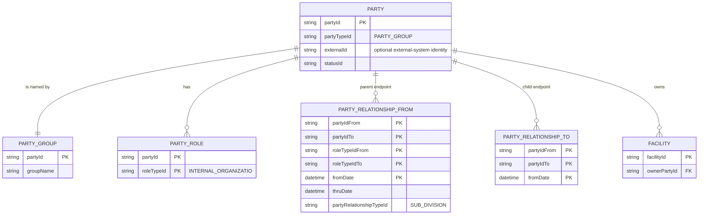
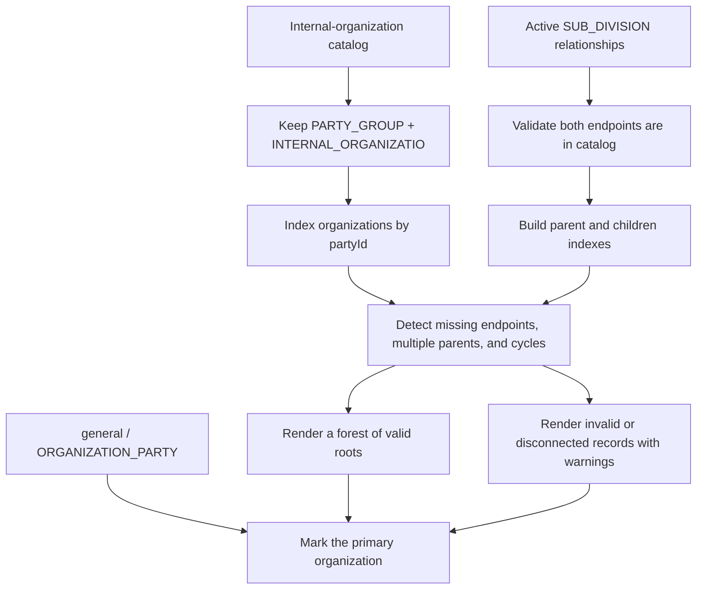
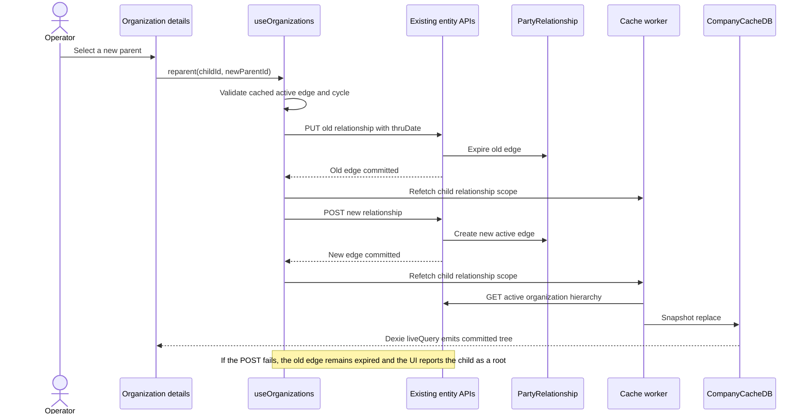
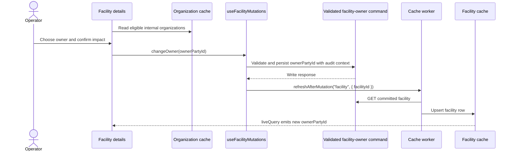
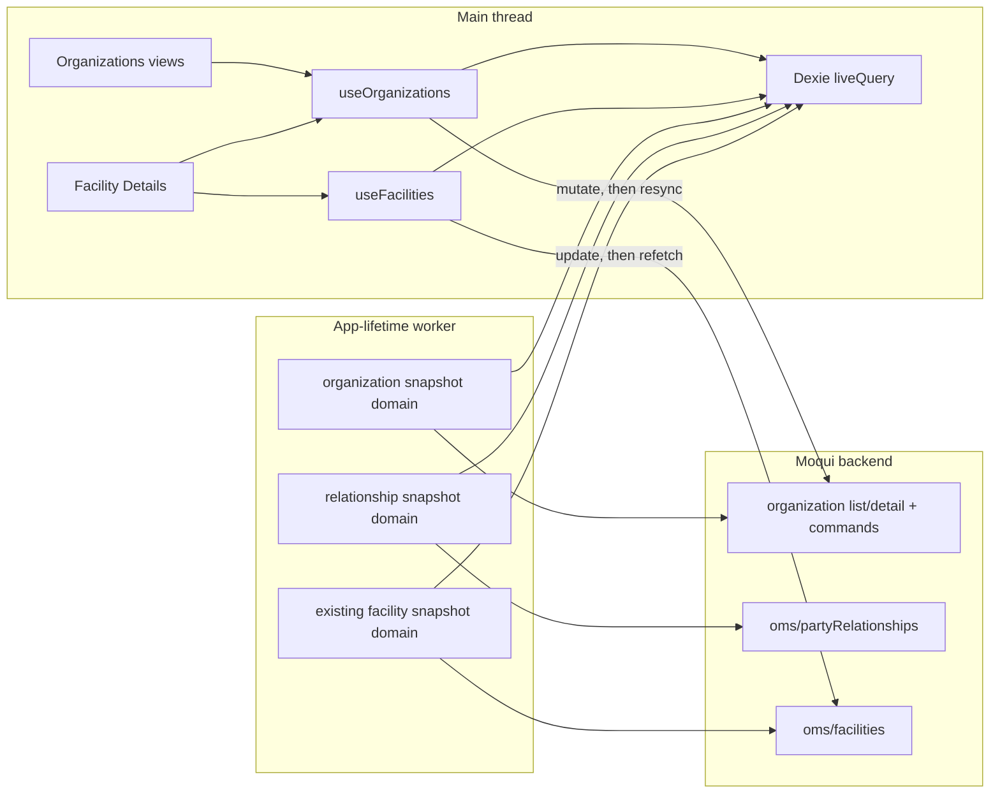
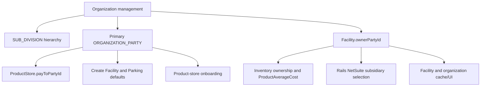

# Organization management architecture

**Status:** phases 1 and 2 implemented in the Company app; live-backend/UI verification remains.
Facility-owner editing (phase 3) and first-record compatibility removal (phase 4) are not
implemented.

**Scope:** manage internal organizations and their hierarchy in the Company app, and allow a
facility's owning organization to be viewed and changed from Facility Details.

## 1. Problem to solve

The Company app currently treats the operating organization as one stable scalar:
`useOrganization().loadOrganizationPartyId()` requests the first
`INTERNAL_ORGANIZATIO` role and memoizes its `partyId`. That was sufficient when an instance was
assumed to have one company. It is not a safe foundation for organization management:

- an instance may contain several internal organizations;
- internal organizations may form a parent/subsidiary hierarchy;
- facilities may be owned by different organizations;
- product stores and onboarding still need one explicitly configured **primary operating
  organization**;
- changing a facility owner can affect accounting and integration behavior.

The implementation must therefore separate these two concepts:

| Concept | Source of truth | Meaning |
| --- | --- | --- |
| Organization catalog and hierarchy | `Party`, `PartyGroup`, `PartyRole`, `PartyRelationship` | Every manageable internal organization and its active parent/subsidiary links |
| Primary operating organization | `general/ORGANIZATION_PARTY` system property | The default used by onboarding, new product stores, new facilities, parking, dropdowns, and reports |

The primary organization is one member of the catalog. It must never be inferred from list order.

## 2. Proven domain model

An organization is not every `PARTY_GROUP`. It is the intersection of:

1. `Party.partyTypeId = PARTY_GROUP`;
2. a matching `PartyGroup` record;
3. a matching `PartyRole.roleTypeId = INTERNAL_ORGANIZATIO`.

The exact role ID is `INTERNAL_ORGANIZATIO`, including its existing truncated spelling.

Parent/subsidiary links use active `PartyRelationship` records with:

- `partyRelationshipTypeId = SUB_DIVISION`;
- parent in `partyIdFrom`;
- child in `partyIdTo`;
- `roleTypeIdFrom = INTERNAL_ORGANIZATIO`;
- `roleTypeIdTo = INTERNAL_ORGANIZATIO`;
- a `fromDate` at or before now;
- no `thruDate`, or a `thruDate` after now.

Rails' proposed seed data demonstrates the intended shape: `Rails International, LLC` is the
parent and `Rails Retail 1 NY LLC` is its child. It also demonstrates why role filtering is
load-bearing: NetSuite departments and default-customer buckets are also represented by
`Party` + `PartyGroup`, but they do not have the internal-organization role and must not appear on
this screen.

The two relationship boxes above represent the two directional roles of the same
`PartyRelationship` entity; they are separated only to make the Mermaid cardinality readable.

## 3. Product experience

### 3.1 Navigation and routes

Add a permission-filtered **Organizations** entry beside Product Store in the main Company
navigation.

| Route | Purpose |
| --- | --- |
| `/organizations` | Searchable organization forest, primary-organization indicator, create action |
| `/organization-details/:partyId` | Organization name/identity, parent, children, owned facilities, edit and move actions |
| `/facility-details/:facilityId` | Existing page; add an Ownership card and owner-change action |

Proposed route permissions:

- read: `PARTYMGR_VIEW OR PARTYMGR_ADMIN`;
- create, rename, move, or change ownership: `PARTYMGR_ADMIN`.

These reuse existing permissions. Backend artifact authorization remains authoritative; hiding a
button is not authorization.

### 3.2 Organization list

The first screen is a forest rather than a flat list:

- show every internal organization exactly once and display any meaningful `Party.statusId` rather
  than assuming its semantics;
- render children as inset lists under their active parent;
- identify the configured primary organization with a badge;
- treat an organization with no active parent as a root;
- surface, rather than hide, invalid data such as multiple active parents, a missing endpoint, or
  a cycle;
- sort siblings by `groupName`, then `partyId` as a stable tie-breaker;
- provide flat search results while preserving a breadcrumb to the matched node.

### 3.3 Organization create and edit

The create form manages one business concept while the backend persists three records:

1. create `Party` with `partyTypeId = PARTY_GROUP` and the optional external ID in `externalId`;
2. store `PartyGroup.groupName`;
3. create the `INTERNAL_ORGANIZATIO` `PartyRole`;
4. optionally create an active `SUB_DIVISION` relationship from the selected parent.

The party-ID generation and validation contract must be decided before implementation; the app
must not casually derive a permanent identity from the editable display name. `externalId` is
editable and optional; the current order-export mapping treats it as the subsidiary ID, but it is
not the hierarchy key.

Do not copy the primary company's full `DEFAULT_COMPANY_ROLE_TYPE_IDS` set onto every subsidiary.
Gurveen's model gives each subsidiary the internal-organization role; billing, customer, supplier,
vendor, contact, and other roles should be added only when a proven workflow requires them.

The phase-2 implementation reuses the existing generic entity endpoints, so no new API or
DataDocument was required. Creation is therefore a staged browser workflow, not one transaction:
the UI refreshes every committed cache domain and reports exactly which stages were already saved
if a later call fails. A durable transactional command remains the preferred follow-up if
concurrent administration or rollback guarantees become necessary.

Renaming changes only `PartyGroup.groupName`. It must not rewrite `partyId`, `externalId`,
relationships, facility ownership, or product-store accounting identity.

External-ID editing is a separate party mutation through `PUT oms/parties/{partyId}` with
`externalId`. The detail screen refreshes the exact `organization` cache record after success and
allows an administrator to clear the mapping with an empty value.

Deletion is out of scope for the first release. Internal organizations can be referenced by
facilities, product stores, inventory/accounting records, orders, returns, and integration data.
A safe archive/deactivation contract needs separate referential-impact analysis.

The detail screen may offer **Make primary organization** as a separate, high-impact admin action.
That action changes only `general/ORGANIZATION_PARTY` after validating that the selected party is
still an internal organization. It changes future defaults and reports; it must not rewrite
existing `ProductStore.payToPartyId`, `Facility.ownerPartyId`, inventory ownership, relationships,
or history.

### 3.4 Move or reparent

Moving a child is a temporal change, not an update-in-place and not a delete:

1. re-read the child's active `SUB_DIVISION` relationships;
2. reject a cycle, self-parent, duplicate edge, or second active parent;
3. expire the old relationship by setting `thruDate`;
4. create the new relationship with a new `fromDate`;
5. refresh the relationship cache after each committed write.

Phase 2 performs steps 3 and 4 through the existing endpoints and reports when step 3 committed but
step 4 failed, leaving the organization as a root. A future transactional reparent command can
replace those two primitives without changing the UI or hierarchy cache seam.

Moving an organization changes only the hierarchy. It does **not** implicitly change the owner of
facilities owned by that organization or by any descendant.

Do not optimistically hand-patch the hierarchy. The server is authoritative and the page should
update from the cache write after the committed re-read.

### 3.5 Facility owner management

Facility ownership belongs in the top summary area of Facility Details as a dedicated
**Ownership** card. It must not be placed in the existing **Staff** segment:

- `Facility.ownerPartyId` is the owning organization;
- `FacilityParty` rows in Staff are dated role assignments for people or other parties;
- these are different entities with different side effects.

The card should show:

- current organization name and `partyId`;
- primary-organization badge when applicable;
- an explicit warning when `ownerPartyId` is empty or points outside the internal-organization
  catalog;
- **Change owner** only for authorized users.

The picker contains only internal organizations. Before committing, the confirmation must explain
that the change affects future owner-derived integration/accounting behavior and does not
automatically migrate historical or existing inventory ownership.

New physical and virtual facilities should default to the explicitly configured
`ORGANIZATION_PARTY`, not the first organization in the list. A future create screen may allow an
operator to override that default, but absence of a configured primary organization must block
creation with a clear error rather than silently selecting a subsidiary.

## 4. Frontend architecture

### 4.1 Data domains

Both organization domains are class B reference/config data: snapshot once per login, then refresh
only after a mutation.

| Domain | Table | Primary key/indexes | Source |
| --- | --- | --- | --- |
| `organization` | `organizations` | `partyId`; indexes on `groupName`, `externalId`, `statusId` | `admin/organizations` role list enriched through bounded-detail fan-out to `oms/parties/{partyId}`, then filtered to `PARTY_GROUP` |
| `organizationRelationship` | `organizationRelationships` | synthetic relationship key; indexes on `partyIdFrom`, `partyIdTo`, `fromDate`, `thruDate` | `oms/partyRelationships` filtered to `SUB_DIVISION` and both internal-organization roles |
| `facility` | existing `facilities` | existing `facilityId`; add projected `ownerPartyId` | existing `oms/facilities` / `oms/facilities/{id}` |

The relationship synthetic key must include the full natural key:
`partyIdFrom + partyIdTo + roleTypeIdFrom + roleTypeIdTo + fromDate`. A parent/child pair may have
several historical rows.

The implementation touches the established cache seams:

- add tables/indexes to `CACHE_SCHEMA` in `src/utils/appCacheDb.ts` without adding a Dexie version;
- add projections and cached entities in `src/utils/cacheEntities.ts`;
- add both class-B entries to `src/utils/cacheDomainCatalog.ts`;
- register the relationship snapshot in `referenceDomains.ts` and the enriched organization
  snapshot in `organizationDomain.ts`;
- expose reads and writes only through a new `src/composables/useOrganizations.ts`;
- add `ownerPartyId` to `facilityProjection`;
- in phase 3, add an intent-shaped `useFacilityMutations().changeOwner()` that calls the validated
  backend command and then refreshes the existing facility domain.

The new views must respect the existing hydration contract:

- `!hydrated`: skeleton;
- `hydrated && no organizations`: genuine empty/setup state;
- warm cache: render immediately without an entry fetch.

### 4.2 Primary organization compatibility seam

`useOrganization` currently owns both first-run bootstrap and a single memoized party ID. It must
be split without changing the meaning of existing consumers:

- `useOrganizations` owns the cached catalog, hierarchy, create/rename/reparent mutations, anomaly
  detection, and organization lookup by ID.
- a small primary-organization seam owns the `ORGANIZATION_PARTY` system property and resolves its
  organization from the cache.
- `loadOrganizationPartyId()` remains temporarily as a compatibility wrapper, but reads the system
  property instead of `admin/organizations?pageSize=1`.

Existing single-organization consumers must continue to use the primary organization until their
own product requirements say otherwise:

- `CreateProductStore.vue`: `ProductStore.payToPartyId`;
- `ProductStoreOnboarding.vue`: company bootstrap, `payToPartyId`, and facility owner;
- `CreateFacility.vue`: default `ownerPartyId`;
- `Parking.vue`: default `ownerPartyId`;
- `useProductStores.ts`: organization detail during setup;
- `CreateProductStore.vue`: editing the displayed parent-company name.

The company-name edit in product-store creation is especially sensitive: after multiple
organizations exist, it must edit the configured primary organization only and label that intent
clearly. It must never rename whichever organization happened to sort first.

## 5. Backend contracts

### 5.1 Contracts already present

| Contract | Current behavior | Use |
| --- | --- | --- |
| `GET admin/organizations` | Lists `PartyRole`; supports `roleTypeId` filtering but does not return names | Existing primary lookup only; insufficient for a list screen |
| `POST admin/organizations` | Creates `Party` | One step of organization creation |
| `GET admin/organizations/{partyId}` | Reads `PartyGroup` | Existing name lookup |
| `POST admin/organizations/{partyId}` | Stores `PartyGroup` | Rename/name step |
| `POST admin/organizations/{partyId}/roles` | Creates/stores `PartyRole` | Add internal-organization role |
| `GET/POST/PUT oms/partyRelationships` | Lists, creates, and updates dated relationships | Hierarchy read and primitive writes |
| `PUT oms/facilities/{facilityId}` | Primitive `Facility` update, including `ownerPartyId` | Existing low-level capability; insufficient business guardrails by itself |
| `GET oms/facilities` | Lists `FacilityAndType`, including all `Facility` fields | Cached facility snapshot |
| `GET/PUT admin/systemProperties` | Lists and stores system properties | Read and deliberately change `general/ORGANIZATION_PARTY` |

### 5.2 Optional hardening and later-phase contract improvements

Phases 1 and 2 do not require a new API. The following changes reduce cost or add guarantees that
the existing entity APIs cannot provide:

1. **Joined organization read optimization.** Change or add a list resource backed by
   `co.hotwax.party.party.PartyNameAndRoleDetail`, filtered to
   `partyTypeId=PARTY_GROUP` and `roleTypeId=INTERNAL_ORGANIZATIO`. This avoids one name request per
   organization. If `admin/organizations` is enriched in place, existing `partyId` and
   `roleTypeId` fields must remain compatible.
2. **Complete organization detail optimization.** A single detail response could include the
   `Party` fields needed by the screen (`partyTypeId`, `externalId`, `statusId`) plus
   `PartyGroup.groupName`. Phase 1 currently gets this shape from `oms/parties/{partyId}`.
3. **Transactional create command.** Persist `Party`, `PartyGroup`, `PartyRole`, and optional parent
   relationship atomically with validation.
4. **Transactional reparent command.** Expire the existing active edge and create the new edge
   atomically after server-side cycle and concurrent-parent validation.
5. **Validated and auditable owner-change command.** Reject a target that is not a current
   `PARTY_GROUP`/`INTERNAL_ORGANIZATIO` organization, record actor/time/old owner/new owner, and
   update the facility in one transaction. A generic `Facility` update alone does not enforce this
   business rule, and `Facility.ownerPartyId` is not currently marked `enable-audit-log`.
6. **Validated primary-organization command.** If the UI exposes **Make primary**, validate the
   selected internal organization before storing `general/ORGANIZATION_PARTY`, and return the
   committed property value for refresh.

Generic entity endpoints remain the phase-2 implementation. Business commands should replace them
if transactional and concurrency guarantees become required.

## 6. Invariants and validation

These are the target invariants. The hierarchy builder and phase-2 UI enforce what they can for
feedback and safe rendering, but the generic write APIs do not yet guarantee all of them
transactionally:

- every managed organization has `Party`, `PartyGroup`, and the internal-organization role;
- every active hierarchy endpoint is a managed internal organization;
- a child has at most one active `SUB_DIVISION` parent;
- self-parenting and cycles are rejected;
- duplicate active relationships are rejected;
- effective dating uses the server's current timestamp;
- the configured primary organization exists in the managed catalog;
- a facility owner is either a managed internal organization or empty only when the backend
  explicitly permits an unowned facility;
- reparenting does not cascade facility ownership;
- renaming does not change external identity;
- removal/archival never hard-deletes referenced party data.

The hierarchy builder must still defend against bad historical or externally written data. It
should return `{ roots, byId, anomalies }`, not recurse blindly.

## 7. Side effects and blast radius

| Impact zone | Existing dependency | Required protection |
| --- | --- | --- |
| Primary organization lookup | `useOrganization` currently takes `pageSize: 1` from the role list | Resolve `ORGANIZATION_PARTY`; never infer from organization ordering |
| Primary organization change | The system property supplies defaults and reports | Treat it as a separate confirmed action; do not cascade it into existing product stores or facilities |
| Product-store accounting identity | `ProductStore.payToPartyId` is the organization to which GL transactions are posted | Organization-tree changes must not silently rewrite existing product stores |
| Returns | Return preparation resolves `toPartyId` from `ProductStore.payToPartyId` | Keep facility ownership separate from return/pay-to identity |
| New product stores | Create and onboarding flows populate `payToPartyId` from the current scalar | Continue using the explicit primary organization unless the UI later adds a deliberate selector |
| New facilities and parking | Creation stamps `ownerPartyId` from the current scalar | Default from the primary organization; block when it is missing or invalid |
| Existing facility cache | `FacilityAndType` already returns `ownerPartyId`, but `facilityProjection` currently drops it | Project and index/read it; refresh the facility row after mutation |
| Facility Staff | Staff uses dated `FacilityParty` records | Do not represent ownership as `FacilityParty`; do not refresh the wrong domain |
| Weighted average cost | `store#ProductAverageCost` prefers `InventoryItem.ownerPartyId`, then falls back to `Facility.ownerPartyId`; `organizationPartyId` is part of the cost record key | Changing a facility owner does not guarantee existing inventory changes owner; define migration/reconciliation separately |
| Existing inventory | Inventory items may already carry their own `ownerPartyId` | Never bulk-rewrite inventory from the Company UI without a separately reviewed migration |
| Rails sales-order export | Rails resolves NetSuite `subsidiary.id` from `Facility.ownerPartyId` and then `Party.externalId` | Confirmation must warn about future exports; owner must have the required external identity |
| Organization external ID | Rails uses the organization's `Party.externalId` as NetSuite subsidiary ID | Treat as integration-sensitive, validate uniqueness/format per integration, and do not derive from `partyId` |
| Hierarchy move | `SUB_DIVISION` describes parent/subsidiary structure | Do not cascade owner, external ID, product store, or accounting changes |
| Cache lifecycle | Class B data syncs once per login and after in-app mutations | Register both domains, refresh after every successful command, and retain manual refresh for outside-app writes |
| Cache schema | `CompanyCacheDB` uses one disposable schema version | Add tables/indexes to version 1; allow schema mismatch rebuild; do not add `version(2)` |
| Logout/session | Cached data is cleared on logout; module state otherwise survives an SPA session | Avoid new module-level server-data memos or register any unavoidable session state with `sessionScope` |
| Permissions | Facility routes currently use only `authGuard`; organization/user routes use party permissions | Gate organization routes and mutations; add mutation gating to the owner card without assuming route access is write access |
| i18n | Every user-facing string belongs in `src/locales/en.json` | Add labels, confirmations, errors, anomaly messages, and empty states there |
| Settings diagnostics | Cache status is catalog-driven | New domains automatically need reader-facing labels and must appear in Data Fetch Status |

### 7.1 Owner-change accounting boundary

The owner picker must not promise that changing `Facility.ownerPartyId` transfers inventory or
history. In the current backend:

1. weighted-average-cost calculation first uses `InventoryItem.ownerPartyId`;
2. it falls back to `Facility.ownerPartyId` only when the inventory item has no owner;
3. `ProductAverageCost.organizationPartyId` is part of the record's primary key.

Therefore an owner change can produce mixed old/new ownership unless the current inventory is
audited and a separate migration policy is chosen. The first Company release should:

- change the facility field only;
- display a high-impact confirmation;
- use a business command that records the actor, timestamp, old owner, and new owner because the
  entity field does not currently have automatic audit logging;
- explicitly exclude inventory-item and average-cost migration.

### 7.2 Integration boundary

Rails' current sales-order customization derives NetSuite subsidiary from:

`order facility -> Facility.ownerPartyId -> Party.externalId -> subsidiary.id`.

Before an owner change is accepted for an integration-enabled facility, the UI or backend should
validate that the target organization has the required external identity. The generic
`Party.externalId` field has no integration type, so a longer-term multi-ERP design should prefer a
typed party-identification model rather than assuming one global external ID.

## 8. Failure handling and concurrency

| Failure | Expected behavior |
| --- | --- |
| Organization snapshot fails on a cold cache | Keep the skeleton until bootstrap ends, show a retryable error, do not show a false empty state |
| Relationship snapshot fails but organizations load | Show a flat/disconnected catalog with a hierarchy-unavailable warning; disable move actions |
| Unknown `ownerPartyId` | Show the raw ID and warning; do not coerce it to the primary organization |
| A later create stage fails | Report which earlier stages were committed and resync both domains; the operator reviews before retrying |
| Reparent POST fails after old edge closes | Resync relationships and report that the organization is currently a root |
| Concurrent reparent | Not protected by the generic APIs; a transactional command with a stale-edge check is the follow-up when concurrent administration becomes material |
| Facility update succeeds but refetch fails | Show a refresh warning and offer domain refresh; do not hand-patch the cached row |
| Primary organization is missing | Allow catalog repair for admins, but block flows that require a default accounting/owner identity |
| Cycle or multiple parent exists in imported data | Keep the record visible under an anomalies section; do not recurse or silently choose an edge |

## 9. Implementation impact map

| Area | Expected files/zones |
| --- | --- |
| Cache schema and projections | `src/utils/appCacheDb.ts`, `src/utils/cacheEntities.ts` |
| Domain catalog and worker registration | `src/utils/cacheDomainCatalog.ts`, `src/workers/domains/referenceDomains.ts` |
| Organization logic | new `src/composables/useOrganizations.ts`; narrow primary-organization compatibility changes in `src/composables/useSeed.ts` or a renamed focused module |
| Organization screens | new views in `src/views/`; organization components/modals in `src/components/organization/` |
| Facility owner UI | `src/views/FacilityDetails.vue`; add `changeOwner` to `useFacilityMutations` in `src/composables/useFacilities.ts` |
| Facility create defaults | `src/views/CreateFacility.vue`, `src/views/Parking.vue`, onboarding facility creation |
| Product-store compatibility | `src/views/CreateProductStore.vue`, `src/views/ProductStoreOnboarding.vue`, `src/composables/useProductStores.ts` |
| Routing and navigation | `src/router/index.ts`, `src/components/common/Menu.vue` |
| Permissions | route guards, mutation controls, and potentially backend artifact authorization/permission seed |
| Copy and accessibility | `src/locales/en.json`; nested-list semantics, keyboard operation, focus return from modals |
| Unit tests | hierarchy derivation, anomaly/cycle detection, effective dates, mutation refresh, primary-org resolution |
| Component tests | cold/warm organization states, permission gating, facility owner display/change/unknown owner |
| Backend follow-up tests | transactional create/reparent rollback and concurrent reparent if command APIs are added; owner eligibility validation for phase 3 |
| Architecture docs after implementation | update `AGENTS.md` cache-domain and composable maps |

## 10. Delivery sequence

### Phase 0: backend contract proof — completed for existing routes

- probe the organization, relationship, system-property, and facility responses on a real target
  instance;
- confirm paging, envelopes, filtering, field presence, and permission behavior;
- confirm that the organization joined view is available in the deployed component set;
- confirm the existing primitive writes can begin phase 2 without a new API; record their
  non-transactional limitation.

### Phase 1: read-only organization catalog — implemented

- add class-B organization and relationship cache domains;
- build and unit-test the pure hierarchy derivation;
- add permission-gated list and detail routes;
- show primary organization, hierarchy, owned facilities, and anomalies;
- do not expose mutations yet.

### Phase 2: organization writes — implemented with existing entity APIs

- add staged create and reparent workflows using the existing entity endpoints;
- add rename;
- refresh the exact organization or relationship domain after writes;
- verify partial-failure reporting, permissions, and cache propagation; concurrency protection
  remains a backend follow-up.

### Phase 3: facility ownership — not implemented

- keep the `ownerPartyId` projection added for the phase-1 owned-facility list;
- add the Facility Details Ownership card and eligible-organization picker;
- validate integration identity and show the accounting/integration warning;
- keep inventory/accounting migration out of scope;
- verify the committed facility row in the UI and IndexedDB.

### Phase 4: remove the first-record assumption

- change the primary-organization seam to read `ORGANIZATION_PARTY`;
- regression-test product-store creation, onboarding, physical facility creation, parking, and
  company-name editing;
- audit every remaining `organizationPartyId` consumer before removing the compatibility wrapper.

## 11. Verification evidence

Code/build checks alone are insufficient because the requested behavior is visible and cache-driven.
Completion requires:

1. unit tests for active-date filtering, forest derivation, stable sorting, missing endpoints,
   multiple parents, and cycle guards;
2. component tests for cold cache, warm cache, genuine empty state, permissions, unknown owner, and
   mutation failure;
3. real-backend API proof for all response shapes and business commands;
4. live browser proof that:
   - an organization created in the app appears without reload;
   - reparenting moves exactly one node and preserves history;
   - Facility Details shows the current owner;
   - changing owner updates the rendered card and the `facilities` IndexedDB row;
   - logout clears the new tables;
   - an external backend write appears after manual reference refresh;
5. regression proof for product-store onboarding, Create Product Store, Create Facility, Parking,
   and facility Staff management;
6. downstream validation on a Rails-like integration that the selected facility owner produces the
   intended NetSuite subsidiary for a new export, without claiming historical inventory migration.

## 12. Decisions still required before implementation

1. Should `PARTYMGR_ADMIN` be the final write permission, or should organization and facility-owner
   writes receive narrower dedicated permissions?
2. What is the canonical party-ID generation rule, uniqueness check, and maximum length for a new
   organization?
3. May an instance have several disconnected root organizations, or must every non-primary
   organization ultimately descend from the primary organization?
4. Should the primary organization be movable beneath another organization? The safe default is
   no.
5. Is an unowned facility valid? Existing create flows assume an owner, but the entity field itself
   is optional.
6. What operational process, if any, migrates existing `InventoryItem.ownerPartyId` and
   `ProductAverageCost` state after a facility owner changes?
7. What archive/status model replaces deletion for an internal organization with historical
   references?
