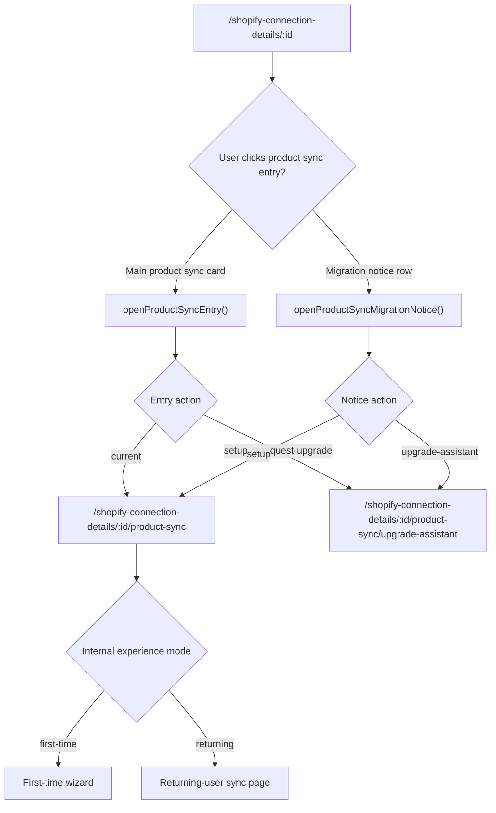
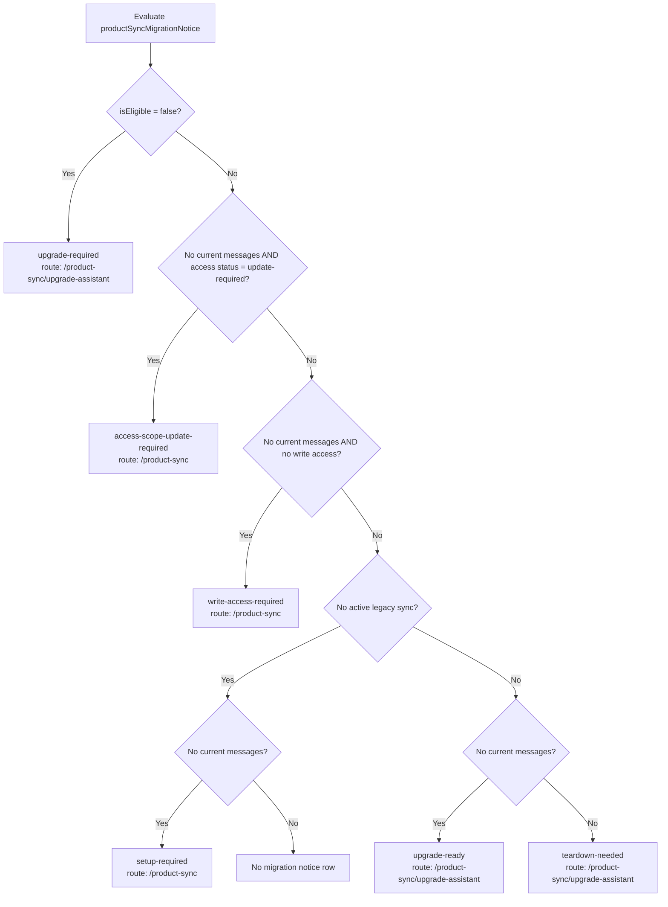
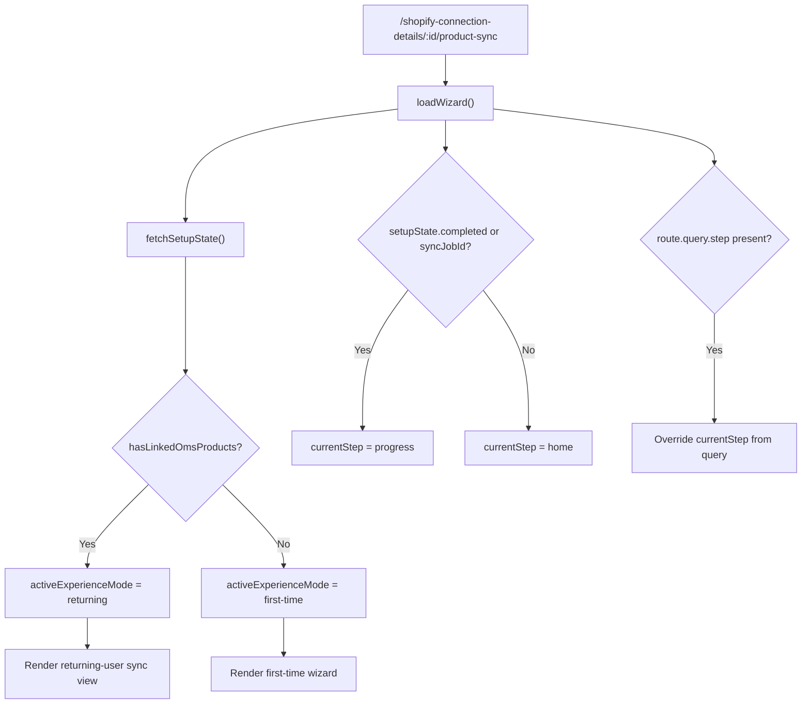
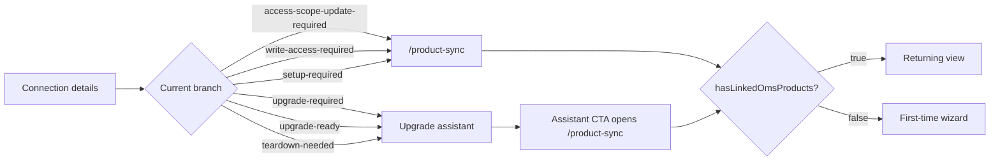

# Shopify Product Sync Routing Logic

This document describes the current routing and view-selection logic starting from `/shopify-connection-details/:id` and ending at the product sync experience.

It is intentionally split into:

1. What the app currently does
2. Which predicates drive each transition
3. Where the current implementation overlaps or disagrees

## Routes Involved

- `/shopify-connection-details/:id`
  - Connection details landing page
- `/shopify-connection-details/:id/product-sync`
  - Product sync page
  - This route can render either the first-time wizard or the returning-user dashboard
- `/shopify-connection-details/:id/product-sync/upgrade-assistant`
  - Migration readiness / teardown assistant
- `/shopify-connection-details/:id/product-sync/history`
  - Returning-user history page

## Source Files

- `src/views/ShopifyConnectionDetails.vue`
- `src/views/ShopifyProductSync.vue`
- `src/views/ShopifyProductSyncUpgradeAssistant.vue`
- `src/services/ShopifyProductSyncMigrationService.ts`
- `src/services/ShopifyProductSyncService.ts`
- `src/utils/shopifyProductSyncWizard.ts`
- `src/router/index.ts`

## Top-Level Router Pushes From Connection Details

There are only two route targets from the connection details page into product sync:

- `/shopify-connection-details/:id/product-sync`
- `/shopify-connection-details/:id/product-sync/upgrade-assistant`

The page does not push directly into a specific wizard step. The `/product-sync` route decides internally whether to show first-time setup or returning-user UI.

## Connection Details State Derivation

The connection details page derives several independent predicates before deciding what to show and where to navigate.

### 1. `effectiveProductSyncMigrationEligibility`

Defined in `ShopifyConnectionDetails.vue`.

Purpose:

- represents whether the backend is considered compatible with the new product sync

Inputs:

- live `productSyncMigrationEligibility`
- debug override `debugPageState`

Rules:

- if `debugPageState === "incompatible"`, force `isEligible = false`
- if `debugPageState !== "live"`, force `isEligible = true`
- otherwise use live backend eligibility

### 2. `hasCurrentProductSyncMessages`

Defined in `ShopifyConnectionDetails.vue`.

Purpose:

- decides whether the page treats the shop as already using the new product sync

Inputs:

- `productSyncSummary.syncRunState.latestSystemMessage`
- `productSyncSummary.syncRunState.systemMessages`
- debug override `debugPageState`

Rules:

- if `debugPageState` is `setup-required`, `upgrade-ready`, or `incompatible`, return `false`
- if `debugPageState` is `teardown-needed` or `upgraded`, return `true`
- otherwise return `true` when there is a latest system message or any system messages

Important:

- this is now consistent with the `/product-sync` page’s `hasLinkedOmsProducts`
- both pages now treat any current new-sync message as the signal for “new sync exists” or “returning user”

### 3. `hasShopifyWriteAccess`

Defined in `ShopifyConnectionDetails.vue`.

Purpose:

- determines whether the shop has write-capable Shopify access for starting sync

Inputs:

- `shopifyAccessState.hasWriteAccess`
- debug override `debugPageState`

Rules:

- if debug state is `setup-required`, `upgrade-ready`, `teardown-needed`, or `upgraded`, force `true`
- otherwise use live access state

### 4. `hasActiveLegacyProductSync`

Defined in `ShopifyConnectionDetails.vue`.

Purpose:

- determines whether legacy product sync artifacts still exist and still matter

Inputs:

- `legacyProductSyncState.legacySystemMessageTypes`
- `legacyProductSyncState.legacyServiceJobs`
- `legacyProductSyncState.legacySystemMessages`
- debug override `debugPageState`

Rules:

- if `debugPageState === "setup-required"`, return `false`
- if `debugPageState === "upgrade-ready"` or `teardown-needed`, return `true`
- if `debugPageState === "upgraded"`, return `false`
- otherwise return `true` if any legacy item has `status === "active"`

Important:

- this ignores legacy items with `partial` status, even though the assistant still treats partial legacy items as actionable

## What Appears On Connection Details

### A. Product Sync Card Visibility

The large product sync card is shown only when:

- `shouldShowProductSyncWidget === true`
- `shouldShowProductSyncWidget` is just `hasCurrentProductSyncMessages`

Meaning:

- the big card is shown only when the page thinks current new-sync messages already exist

### B. Migration Notice Row Visibility

The migration notice row is shown when `productSyncMigrationNotice` returns an object.

It returns these states:

- `upgrade-required`
- `access-scope-update-required`
- `write-access-required`
- `setup-required`
- `upgrade-ready`
- `teardown-needed`

It returns `null` only in one case:

- no active legacy sync
- current new product sync messages already exist

That `null` case effectively means:

- no migration banner
- product sync is already established enough that the page only relies on the main product sync card

## Migration Notice Decision Tree

This is the actual evaluation order in `productSyncMigrationNotice`.

### 1. `upgrade-required`

Condition:

- `effectiveProductSyncMigrationEligibility.isEligible === false`

Target route on click:

- `/product-sync/upgrade-assistant`

Meaning:

- backend release is too old for the new product sync

### 2. `access-scope-update-required`

Condition:

- no current new-sync messages
- `shopifyAccessState.status === "update-required"`

Target route on click:

- `/product-sync`

Meaning:

- the connection uses legacy `SHOP_RW_ACCESS`
- the user is sent into the product sync page, not the upgrade assistant

### 3. `write-access-required`

Condition:

- no current new-sync messages
- no Shopify write access

Target route on click:

- `/product-sync`

Meaning:

- the user is sent to the product sync page even though sync start is blocked by access state

### 4. `setup-required`

Condition:

- no active legacy sync
- no current new-sync messages

Target route on click:

- `/product-sync`

Meaning:

- this is the first-time setup path

### 5. `upgrade-ready`

Condition:

- active legacy sync exists
- no current new-sync messages
- backend is eligible
- access scope is not blocking
- write access is not blocking

Target route on click:

- `/product-sync/upgrade-assistant`

Meaning:

- the shop is migration-ready but still needs readiness review / teardown

### 6. `teardown-needed`

Condition:

- active legacy sync exists
- current new-sync messages already exist

Target route on click:

- `/product-sync/upgrade-assistant`

Meaning:

- the shop is already using new sync, but old sync still needs cleanup

## Product Sync Card Click Logic

The large product sync card uses `openProductSyncEntry()`.

It does:

- route to `/product-sync` when `productSyncEntryAction === "current"`
- otherwise route to `/product-sync/upgrade-assistant`

### Important Problem

`productSyncEntryAction` calls:

- `ShopifyProductSyncMigrationService.resolveEntryAction({ hasNewProductSyncMessages, isEligible })`

But `resolveEntryAction()` is written for the full assistant state, not this partial object.

The assistant version expects:

- `artifactChecks`
- `legacySystemMessageTypes`
- `legacyServiceJobs`
- `legacySystemMessages`
- `syncJobConfigured`

It uses those fields to decide between:

- `current`
- `setup`
- `request-upgrade`

That means the connection-details page and the upgrade-assistant page are not using the same state shape even though they call the same resolver.

Practically, this means:

- the connection-details card is trying to reuse a richer resolver with insufficient inputs
- the card routing logic is not actually aligned with the migration notice logic

This is one of the main reasons the flow should be normalized into a formal FSM.

## `/product-sync` Route: Internal View Resolution

Reaching `/shopify-connection-details/:id/product-sync` does not mean the user is on the returning sync dashboard.

The page resolves its own internal experience mode after load.

### Experience Mode Source

`activeExperienceMode = resolveProductSyncExperienceMode(experienceMode, hasLinkedOmsProducts)`

Rules from `resolveProductSyncExperienceMode()`:

- if `experienceMode` is explicitly `first-time`, return `first-time`
- if `experienceMode` is explicitly `returning`, return `returning`
- if `experienceMode === "auto"`, return:
  - `returning` when `hasLinkedOmsProducts === true`
  - `first-time` when `hasLinkedOmsProducts === false`

### Where `hasLinkedOmsProducts` Comes From

This comes from `fetchSetupState()` in `ShopifyProductSyncService`.

`fetchSetupState()` sets `hasLinkedOmsProducts` using:

- `fetchProductUpdateSyncRunState` which fetches the latest messages.
- Checks if `latestSystemMessage` exists.

Meaning:

- `/product-sync` now treats “returning user” as “there is any new-sync message” (regardless of status).
- This aligns it with the connection-details page and fixes the issue where users with running syncs were thrown back to the first-time flow.

## `/product-sync` Initial Step Resolution

After the page loads setup state, `loadWizard()` sets `currentStep`.

Current logic:

- if `setupState.completed`, go to `progress`
- else if `syncJobId` exists, go to `progress`
- else go to `home`

Then:

- if `route.query.step` exists, it overrides `currentStep`

### Important Problem

`fetchSetupState()` currently returns:

- `hasLinkedOmsProducts`
- `shopifyAccessState`
- `productStoreLocked`
- `identifierLocked`
- `selectedProductStoreId`
- `selectedIdentifierEnumId`

It does not currently populate:

- `syncJobId`
- `completed`

So, with the current implementation:

- `setupState.completed` is effectively absent
- `syncJobId` from setup state is effectively absent
- `loadWizard()` usually falls back to `currentStep = "home"`

That means:

- the `/product-sync` route may still land a user in the first-time wizard home step even if other page-level logic implied a more advanced state

## First-Time Wizard Conditions

The first-time wizard is shown when:

- route is `/product-sync`
- `activeExperienceMode === "first-time"`

In auto mode this means:

- `hasLinkedOmsProducts === false`

Wizard steps:

- `home`
- `product-store`
- `identifier`
- `review`
- `progress`

Step gates:

- `home`
  - always can advance
- `product-store`
  - requires `selectedProductStoreId`
  - and `productStoreLocked || draft.productStoreVerified`
- `identifier`
  - requires `identifierLocked || selectedIdentifierEnumId`
- `review`
  - requires `reviewReady`
- `progress`
  - requires `progressComplete`

## Returning View Conditions

The returning sync dashboard is shown when:

- route is `/product-sync`
- `activeExperienceMode === "returning"`

In auto mode this means:

- `hasLinkedOmsProducts === true`

The page can also switch into returning mode locally after setup completion:

- `completeSetupAndOpenReturningView()` schedules or confirms the recurring sync job
- then sets `experienceMode = "returning"`

Important:

- this is an internal mode switch, not a route change
- the URL remains `/product-sync`

## Upgrade Assistant Conditions

The assistant route is entered from connection details when:

- migration notice action is not `setup`
- or product sync card entry action is not `current`

Inside the assistant, `resolveEntryAction()` uses the full assistant state and returns:

- `request-upgrade`
- `setup`
- `current`

Assistant rules:

- `request-upgrade`
  - when backend is not eligible
- `setup`
  - when backend is eligible but setup is still incomplete
  - incomplete means any of:
    - missing required artifacts
    - actionable legacy items
    - sync job not configured
    - required shared jobs are paused
- `current`
  - when backend is eligible
  - no artifacts are missing
  - no actionable legacy items remain
  - per-shop sync job is configured
  - required shared jobs are not paused

When the assistant’s CTA opens product sync, it always routes to:

- `/shopify-connection-details/:id/product-sync`

The assistant itself does not choose first-time vs returning mode. That still happens inside `ShopifyProductSync.vue`.

## Current End-To-End Routing Matrix

### Connection details -> `/product-sync`

This happens when:

- migration notice state is `access-scope-update-required`
- migration notice state is `write-access-required`
- migration notice state is `setup-required`
- upgrade assistant CTA opens product sync

What the user then sees depends on `/product-sync` internal mode resolution:

- first-time wizard if `hasLinkedOmsProducts === false`
- returning view if `hasLinkedOmsProducts === true`

### Connection details -> `/product-sync/upgrade-assistant`

This happens when:

- migration notice state is `upgrade-required`
- migration notice state is `upgrade-ready`
- migration notice state is `teardown-needed`
- product sync card entry action resolves to anything other than `current`

### `/product-sync` -> internal first-time wizard

This happens when:

- `resolveProductSyncExperienceMode("auto", hasLinkedOmsProducts)` returns `first-time`
- or `experienceMode` was explicitly switched to `first-time`

### `/product-sync` -> internal returning view

This happens when:

- `resolveProductSyncExperienceMode("auto", hasLinkedOmsProducts)` returns `returning`
- or `experienceMode` was explicitly switched to `returning`

## Main Overlaps And FSM Risks

### 1. Two different predicates mean “new sync exists”

Connection details uses:

- `hasCurrentProductSyncMessages`
- based on any current system message

`/product-sync` uses:

- `hasLinkedOmsProducts`
- based on consumed sync history

These are not equivalent.

### 2. Migration notice logic and card-click logic are not driven by the same model

Migration notice uses:

- eligibility
- access state
- legacy state
- current new-sync message presence

Card click uses:

- `resolveEntryAction()` with a partial object that does not match the function contract

These can disagree.

### 3. Legacy state semantics differ between pages

Connection details uses:

- only `status === "active"` to decide `hasActiveLegacyProductSync`

Assistant uses:

- `active`
- `partial`
- active legacy messages

So a partially deactivated legacy setup can still be actionable in the assistant even if the connection page no longer treats legacy sync as active.

### 4. `/product-sync` initial step logic expects fields that `fetchSetupState()` does not currently provide

`loadWizard()` branches on:

- `setupState.completed`
- `setupState.syncJobId`

But `fetchSetupState()` does not currently populate those fields.

That makes the current step resolution weaker than it looks.

### 5. Debug states override only the connection-details page model

`debugPageState` changes:

- eligibility
- current-message existence
- write access
- legacy-active state

But it does not alter the deeper `/product-sync` or assistant service calls.

So the debug dropdown does not represent a single consistent FSM across routes.

## Recommended Canonical FSM Inputs

If this is converted into a real finite state machine, the machine should use one canonical state object shared by:

- connection details
- upgrade assistant
- product sync page

Minimum inputs:

- backend eligibility
- current backend release
- minimum backend release
- access scope state
- has any new-sync message
- has consumed new-sync history
- legacy status
  - none
  - partial
  - active
- per-shop sync job configured
- shared job readiness
- setup completion status

The biggest design decision to make explicitly is:

- what exact condition means “this shop is on the new sync”

Right now the code uses at least two different answers:

- any current message exists
- consumed history exists

Those need to collapse into one canonical machine state.
